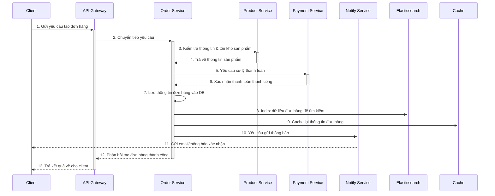

# BE-Baemin-Microservices

Dự án này là một hệ thống backend được xây dựng theo kiến trúc microservices, mô phỏng lại các chức năng cốt lõi của một ứng dụng giao đồ ăn như Baemin. Hệ thống bao gồm các service độc lập như quản lý đơn hàng, thanh toán, sản phẩm, người dùng, và giao hàng.

Đặc biệt, dự án tích hợp **Elasticsearch** để tối ưu hóa hiệu năng tìm kiếm và **Cache** (ví dụ: Redis) để giảm độ trễ và tăng tốc độ truy xuất dữ liệu thường xuyên.

  

## ✨ Tính năng nổi bật

*   **Kiến trúc Microservices:** Hệ thống được chia thành các service nhỏ, độc lập, dễ dàng phát triển, bảo trì và mở rộng.
*   **Tối ưu hóa tìm kiếm:** Tích hợp **Elasticsearch** giúp tìm kiếm sản phẩm, đơn hàng một cách nhanh chóng và chính xác.
*   **Tăng tốc độ với Caching:** Sử dụng **Cache** để lưu trữ các dữ liệu nóng, giảm tải cho database và tăng tốc độ phản hồi của hệ thống.
*   **API Gateway:** Một cửa ngõ (gateway) duy nhất để quản lý, điều hướng và bảo vệ các request đến các microservice.
*   **Containerization:** Toàn bộ dự án được đóng gói bằng Docker và quản lý bởi Docker Compose, giúp việc cài đặt và triển khai trở nên đơn giản.

## 🏛️ Kiến trúc hệ thống

Dự án bao gồm các microservice sau:

*   **api-gateway:** Cửa ngõ chính cho tất cả các request từ client. Chịu trách nhiệm routing, authentication, và load balancing.
*   **user-service:** Quản lý thông tin người dùng, đăng ký, đăng nhập.
*   **product-service:** Quản lý thông tin sản phẩm, danh mục.
*   **order-service:** Xử lý logic tạo và quản lý đơn hàng.
*   **payment-service:** Tích hợp và xử lý các giao dịch thanh toán.
*   **shipping-service:** Quản lý thông tin và trạng thái giao hàng.
*   **notify-service:** Gửi thông báo (email, push notification) đến người dùng.

## 🌊 Luồng xử lý đơn hàng (Order Flow)

Dưới đây là sơ đồ mô tả luồng đi của một yêu cầu tạo đơn hàng mới trong hệ thống.



## 🛠️ Công nghệ sử dụng

*   **Ngôn ngữ:** TypeScript
*   **Framework:** Node.js
*   **Cơ sở dữ liệu:** MySQL 
*   **Tìm kiếm:** Elasticsearch
*   **Caching:** Redis
*   **Containerization:** Docker, Docker Compose
*   **API Gateway:** RabbitMQ

## 🚀 Bắt đầu

### Yêu cầu hệ thống

*   [Docker](https://www.docker.com/get-started) và [Docker Compose](https://docs.docker.com/compose/install/) đã được cài đặt.

### Cài đặt và Chạy dự án

1.  **Clone repository về máy của bạn:**
    ```sh
    git clone https://github.com/Vanquoc0201/BE-Baemin-Microservices.git
    cd BE-Baemin-Microservices
    ```

2.  **Cấu hình biến môi trường:**
    Tạo file `.env` trong mỗi thư mục microservice nếu cần, dựa trên file `.env.example`.

3.  **Khởi chạy toàn bộ hệ thống bằng Docker Compose:**
    ```sh
    docker-compose up -d
    ```
    Lệnh này sẽ build và chạy tất cả các service được định nghĩa trong file `docker-compose.yml`.

4.  **Kiểm tra trạng thái các container:**
    ```sh
    docker-compose ps
    ```

### Dừng hệ thống

Để dừng và xóa các container, sử dụng lệnh:
```sh
docker-compose down
```
